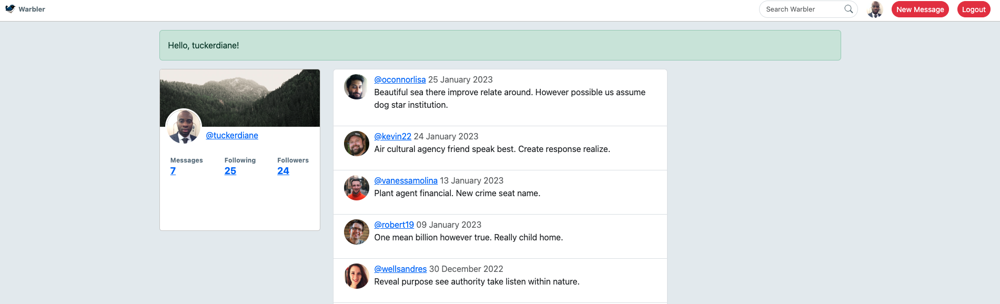

# Warbler

Warbler is a Flask-powered Twitter clone with functionality for users to:

- Register
- Sign in/out
- Follow/unfollow other users
- Like/unlike posts
- Update their profile
- View other user's profiles
- View a feed of posts from users they follow

#### Built with: Python, Flask, Jinja, SQLAlchemy, PostgreSQL

## Demo

### Video Demo:

[](https://youtu.be/EQ_4qoR9ePc)

### Demo as a User:

1. Go to [achang-warbler.onrender.com](https://achang-warbler.onrender.com/)
2. Login

- Username: tuckerdiane
- Password: password

## Installation

To run this app locally:

1. Clone the repo

```sh
git clone git@github.com:alicechang29/flask-warbler.git
```

2. Start Python Virtual Environment

```sh
python3 -m venv venv
$ source venv/bin/activate
(venv) $ pip3 install -r requirements.txt
```

3. Create an .env file to hold configuration

```.env
DATABASE_URL=postgresql:///warbler
SECRET_KEY=<insert your value here>
```

4. Create postgreSQL database and seed the data

```shell
(venv) $ createdb warbler
(venv) $ python seed.py
```

5. Start the Flask server

```sh
flask run -p 5001
```

6. Open in browser: http://localhost:5001

### Collaborators

[Aubrey Sherman](https://github.com/aubrey-sherman)

<!-- MARKDOWN LINKS & IMAGES -->
<!-- https://www.markdownguide.org/basic-syntax/#reference-style-links -->

[linkedin-shield]: https://img.shields.io/badge/-LinkedIn-black.svg?style=for-the-badge&logo=linkedin&colorB=555
[linkedin-url]: https://linkedin.com/in/achang9
